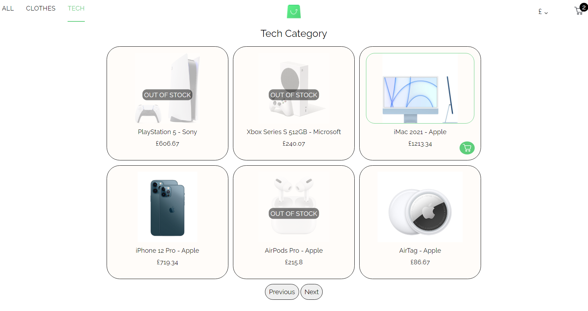

# E-commerce Scandiweb React Test website

## Overview

An e-commerce web app created with react.js fetches products from a graphql endpoint using Apollo client.

## About the project

- There are three categories (All, Clothes, Tech) where the user can choose between them to get the desired products.
- No more than six products are displayed per page.
- Each product’s cost depends on the user’s currency selection from the navbar.
- If the product is out of stock, a layer would be added to the product's image to clarify that the product is out of stock.
- The user can’t show the product description or add it to the cart if it is out of stock.
- The user can add any product to the cart from the product list page, but he must choose all the product attributes first.
- Clicking on the product’s image from the product list page will show more information about the product; eg. all the product images will be shown on this page as a slider design.
- The user can also add the product to the cart from the product description page.
- A number will be shown next to the cart shopping image in the navbar while adding any product to indicate the number of items in the cart.
- To open the cart, the user should hover on the cart shopping image in the navbar.
- The user can remove a product or increase/decrease its quantity in the cart.
- It is not possible to add a project that already exists in the cart (a same project with same attributes).
- The website is responsive over all the screens.

## Dependencies

The dependencies used in this application with its version:

- "@apollo/client": "^3.5.10"
- "graphql": "^16.3.0"
- "react": "^17.0.2"
- "react-dom": "^17.0.2"
- "react-scripts": "5.0.0"

## How to run the project

1. Download and install [nodejs](https://nodejs.org/en/download/)
2. Use this graphql endpoint [here](https://github.com/scandiweb/junior-react-endpoint) [it contains all the data presented on this website].
   1. Download or clone it.
   2. Install its dependencies: `npm install`
   3. Build the project: `npm run build`
   4. Start the project: `npm start`

> The server side is now ready

3. Time to start this project.

   1. Download or clone this repository.
   2. Install its dependencies: `npm install`
   3. Build the project: `npm run build`
   4. Start the project: `npm start`

> The website is now working, hope you enjoy it 😃

## Tour in the website

